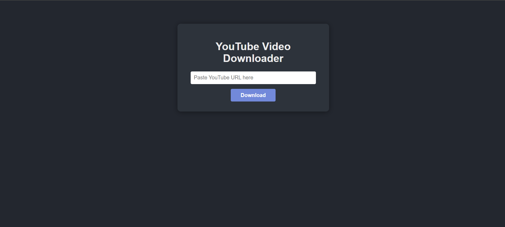

# 🚀 YouTube Video Downloader 🎬

> **Download any YouTube video in seconds!**
>
> ⚡️ Fast. 🖱️ Simple. 💡 No ads. 100% Free.

A modern web app to grab your favorite YouTube videos instantly. Built with Flask and powered by `yt-dlp`, this app gives you a clean, one-click experience to save videos in MP4 format.

## ✨ Features

- 🖥️ **Easy-to-use Web Interface:** Enter a YouTube URL and download the video with a single click.
- 🎥 **Automatic Format Selection:** Always gets the best quality video and audio, merged into MP4.
- 🚦 **Error Handling:** Friendly messages for invalid URLs or download issues.
- 🎨 **Modern UI:** Clean, responsive, and distraction-free design.

## 🛠️ How It Works

1. Paste your favorite YouTube video URL into the form.
2. Hit **Download**.
3. The app fetches the best quality video and audio using `yt-dlp`.
4. You get a ready-to-watch MP4 file in seconds!
5. If something goes wrong, you'll see a helpful message.

## 🖼️ Screenshot

<!-- Add a screenshot of the app UI below -->



---

## 🎬 Demo

<!-- Optionally, add a GIF or video demo here -->


---

## 🏗️ Setup Instructions

### Prerequisites

- 🐍 Python 3.7 or higher
- 📦 `pip` (Python package manager)

### Installation

1. **Clone the repository:**

   ```powershell
   git clone https://github.com/VashuChaudhary/ytflask
   cd ytflask
   ```

2. **Install dependencies:**

   ```powershell
   pip install -r requirements.txt
   ```

3. **Run the application:**

   ```powershell
   python app.py
   ```

4. **Open your browser and go to:**
   ```
   http://127.0.0.1:5000/
   ```

### Notes

- The app uses `yt-dlp` for downloading videos. Make sure your environment allows network access.
- Downloaded files are stored temporarily and sent directly to the user; they are not kept on the server.

## 📁 File Structure

```
yt-cursor/
│
├── app.py                # Main Flask application
├── requirements.txt      # Python dependencies
├── static/
│   └── style.css         # Stylesheet for the web UI
└── templates/
   └── index.html        # HTML template for the homepage
```

## 🧩 Dependencies

- Flask
- yt-dlp

## 📜 License

This project is for educational and personal use only. Please respect YouTube's Terms of Service.
